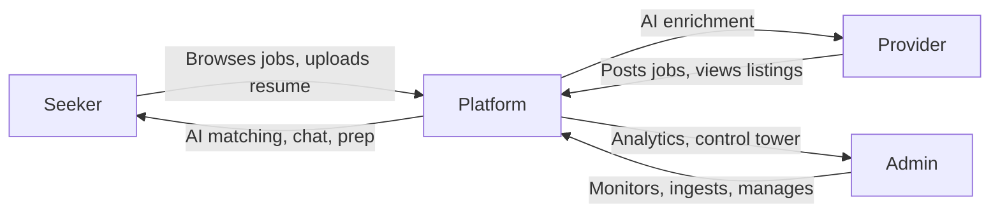

# Business Overview — jobs.ottobon.cloud

## Vision

**Outcome-Driven Recruitment Ecosystem** — connecting job providers directly with seekers via AI-powered matching, preparation, and mentorship. The platform targets university students and early-career professionals pursuing roles at Big 4 consulting firms (Deloitte, PwC, KPMG, EY).

## Problem Statement

| Pain Point | Who Suffers | How Ottobon Solves It |
|---|---|---|
| Job seekers lack interview prep resources | Seekers | AI career coach, mock interviews, gap analysis |
| Employers struggle to surface the right candidates | Providers | AI-powered skill matching via semantic embeddings |
| Scattered job listings across company portals | Seekers | Automated scraping & aggregation from Big 4 sites |
| No actionable feedback after applying | Seekers | Resume tailoring, skill gap analysis, learning recs |
| Admin teams lack visibility into user activity | Admins | Control Tower with session monitoring & analytics |

## User Roles

### 1. Seeker (Job Candidate)
- Browse & search the job feed
- View detailed job pages (AI-enriched with resume guide + prep questions)
- Upload resume → auto-parsed & embedded for matching
- **Match against jobs** → cosine similarity score + gap analysis
- **AI Career Coach** — real-time WebSocket chat for personalized mentorship
- **Mock Interviews** — AI-generated questions → submit answers → AI scorecard
- **Courses & Learning** — recommendations based on skill gaps
- **Resume Tailoring** — AI-powered resume optimization for specific roles

### 2. Provider (Employer / Recruiter)
- Create new job postings (auto-enriched by AI in background)
- View & manage their own listings
- Access **Market Intelligence** dashboard with analytics

### 3. Admin (Platform Operator)
- **Control Tower** — monitor all active chat sessions, intervene if needed
- **Ingestion Management** — trigger/monitor job scraping from Big 4 sites
- **Help Desk** — admin tools for user support

## Revenue Model (Inferred)

| Stream | Description |
|---|---|
| Freemium SaaS | Free job browsing, paid premium features (mock interviews, deep matching) |
| Enterprise B2B | Provider accounts for employers posting and reviewing candidates |
| Data & Analytics | Market intelligence dashboards for institutional subscribers |

## Key Differentiators

1. **AI-First Architecture** — Every feature is AI-powered (matching, enrichment, chat, interviews, blog generation)
2. **Big 4 Focus** — Purpose-built for the consulting recruitment pipeline
3. **Outcome-Driven** — Goes beyond listing jobs to actively preparing candidates
4. **Automated Content** — Blog agent auto-generates weekly career digests from real-time news
5. **Semantic Matching** — Cosine similarity on OpenAI embeddings, not keyword matching
