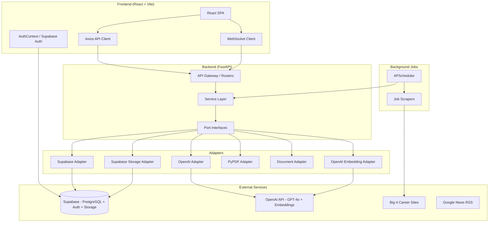
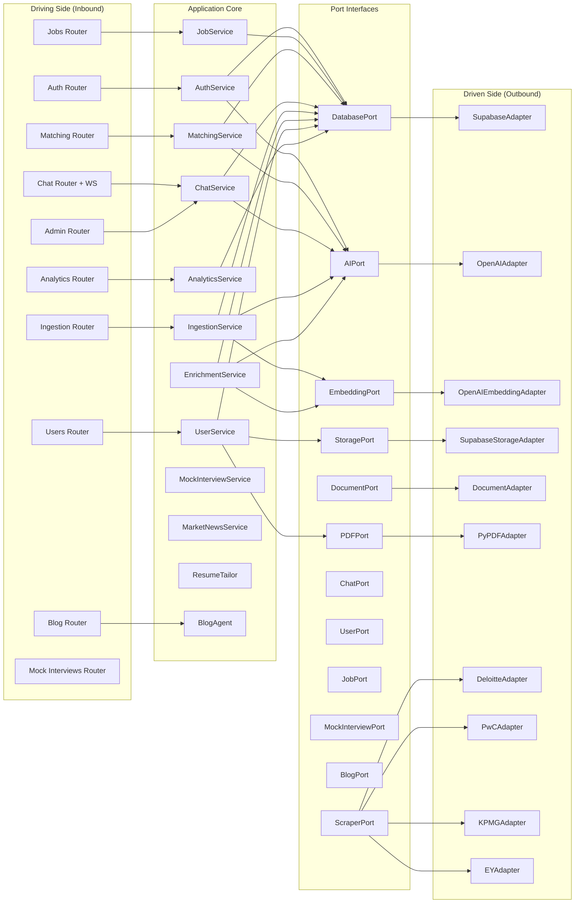
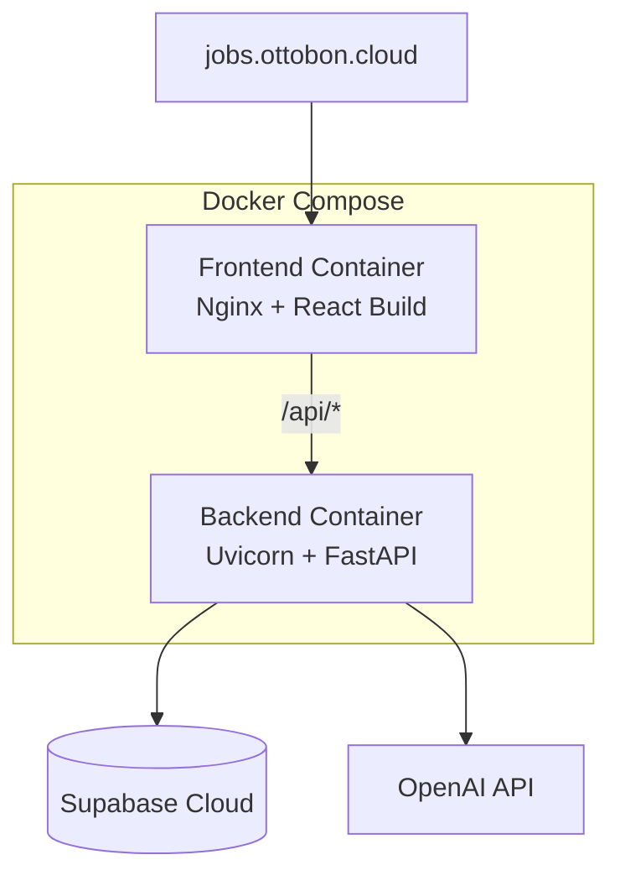

# System Architecture — jobs.ottobon.cloud

## High-Level Architecture

## Technology Stack

| Layer | Technology | Purpose |
|---|---|---|
| **Frontend** | React 19 + Vite 7 | SPA with code-splitting, lazy-loaded routes |
| **Styling** | TailwindCSS 4, Framer Motion | Responsive design + animations |
| **Charts** | Recharts | Market analytics visualizations |
| **3D** | Spline / Three.js | Landing page visual effects |
| **State** | React Context (AuthContext) | Global auth state, role-based routing |
| **HTTP Client** | Axios | API calls with retry, auth interceptor |
| **Realtime** | Native WebSocket | Chat with ping/pong heartbeat, auto-reconnect |
| **Backend** | FastAPI (Python) | Async REST API + WebSocket endpoints |
| **Architecture** | Hexagonal (Ports & Adapters) | Clean separation of concerns |
| **Database** | Supabase (PostgreSQL) | Tables with RLS, pgvector for embeddings |
| **Auth** | Supabase Auth | JWT-based, role in user_metadata |
| **Storage** | Supabase Storage | Resume file uploads |
| **AI** | OpenAI GPT-4o + text-embedding-3-small | Enrichment, matching, chat, interviews |
| **Scheduling** | APScheduler (AsyncIO) | Daily 10 PM IST job ingestion cron |
| **Deployment** | Docker + Nginx | Containerized with reverse proxy |

## Hexagonal Architecture (Backend)

## Deployment Architecture

- **Frontend**: Built with Vite, served via Nginx reverse proxy
- **Backend**: Uvicorn ASGI server running FastAPI
- **Both**: Docker Compose orchestration with `.env` configuration
