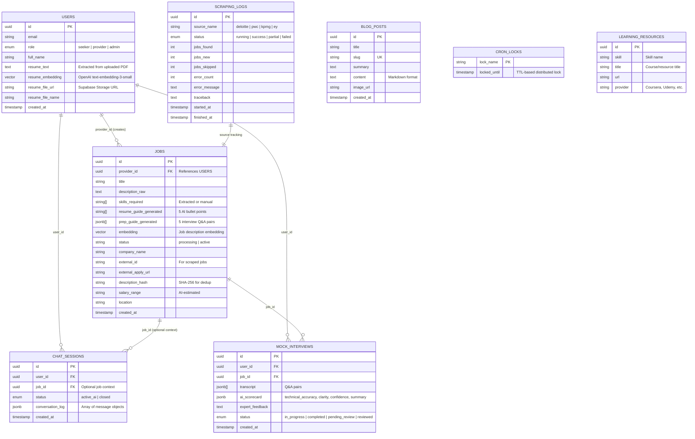

# Data Model — jobs.ottobon.cloud

## Entity Relationship Diagram

## Key Design Decisions

### 1. Embeddings as First-Class Columns
- Both `users.resume_embedding` and `jobs.embedding` store pgvector embeddings
- Enables cosine similarity matching at the database level
- Generated via OpenAI `text-embedding-3-small`

### 2. SHA-256 Description Hashing
- `jobs.description_hash` prevents duplicate AI enrichment
- When a scraped job has the same description as an existing one, enrichment data is copied instead of re-generated (saves ~50% on OpenAI costs)

### 3. Conversation Log as JSONB
- Chat history stored as a JSONB array in `chat_sessions.conversation_log`
- Each entry: `{ role: "user"|"assistant"|"admin", content: string, timestamp: ISO8601 }`
- Hidden system context entries (e.g., job context) marked with `hidden: true`

### 4. System Provider for Scraped Jobs
- All scraped jobs assigned to `provider_id = "00000000-0000-4000-a000-000000000001"`
- This is a system user created by migration to satisfy FK constraints

### 5. Distributed Locking
- `cron_locks` table with TTL-based locking via PostgreSQL RPC
- Prevents duplicate cron runs across multiple Uvicorn workers
