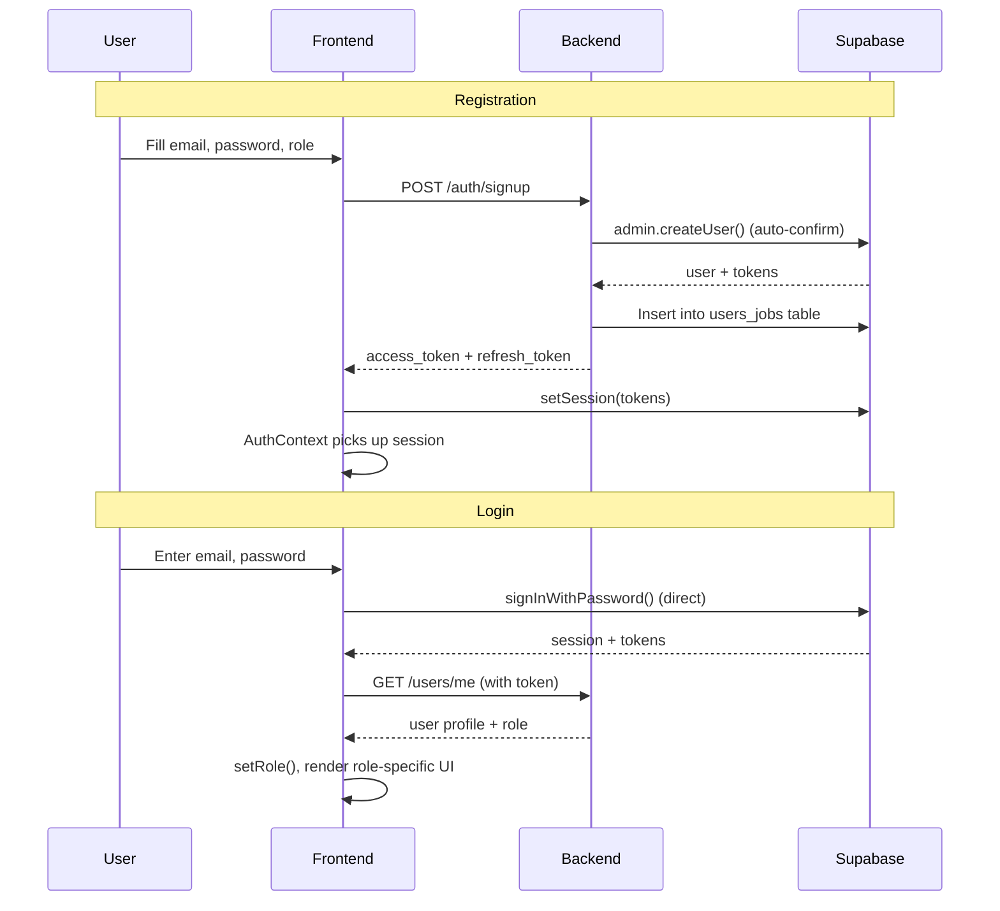
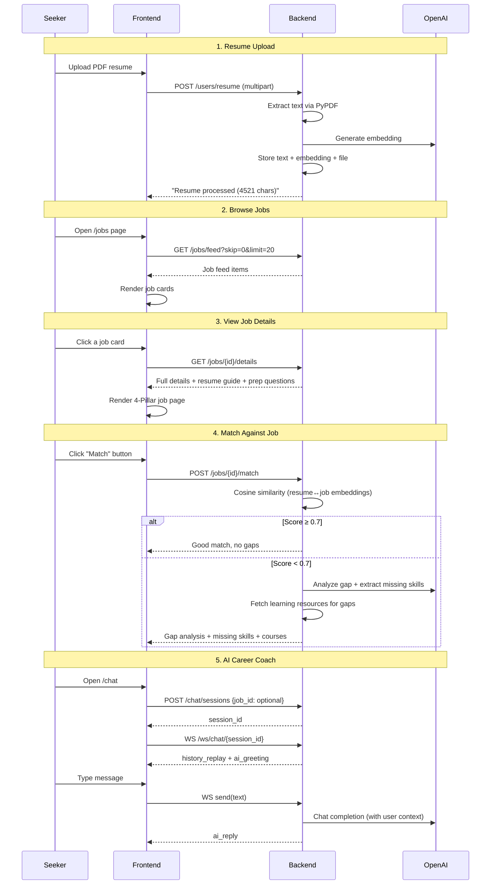
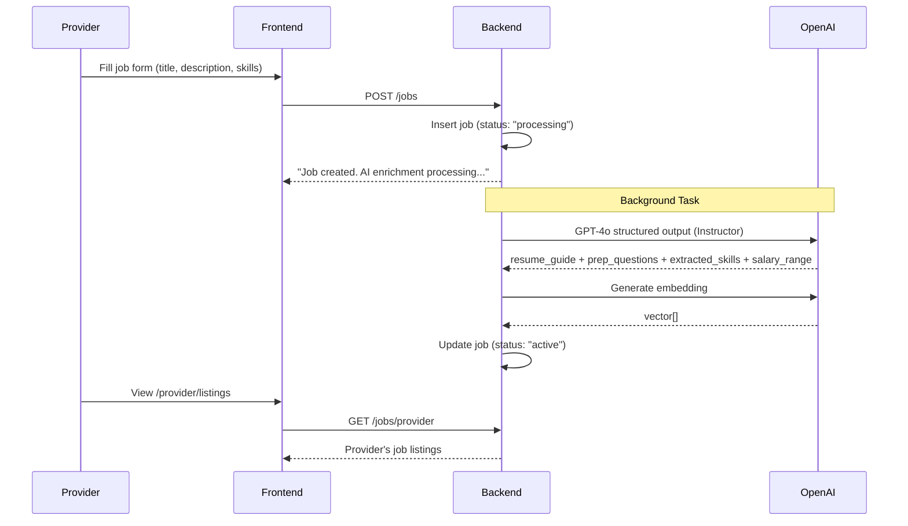
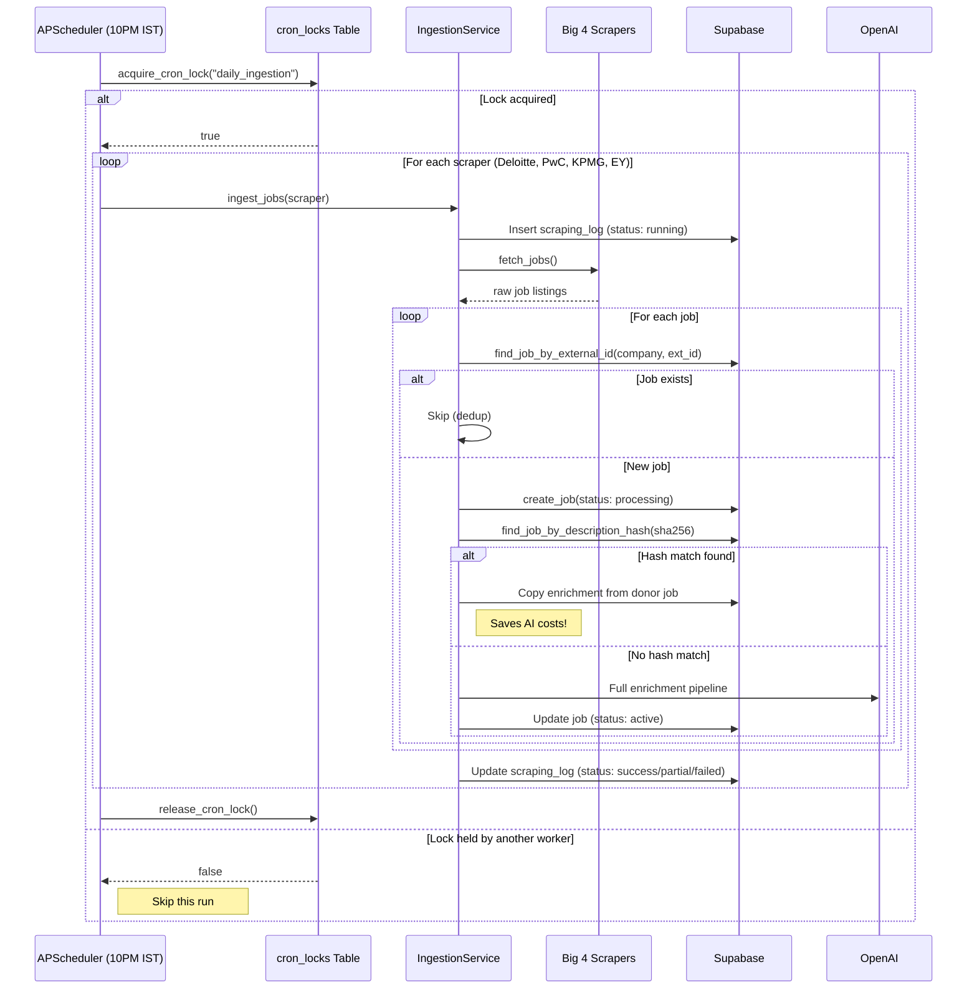
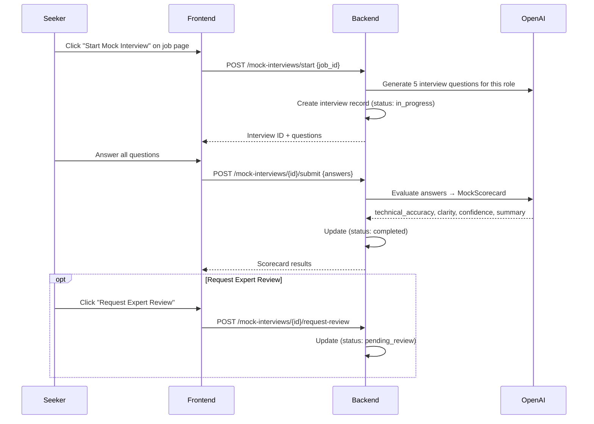
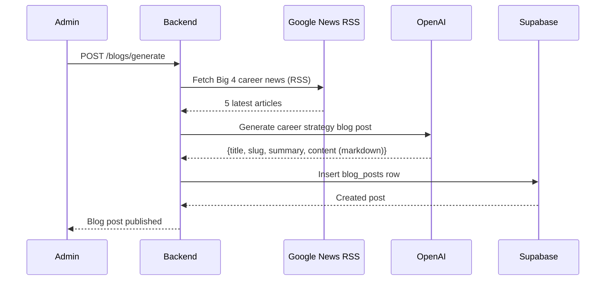
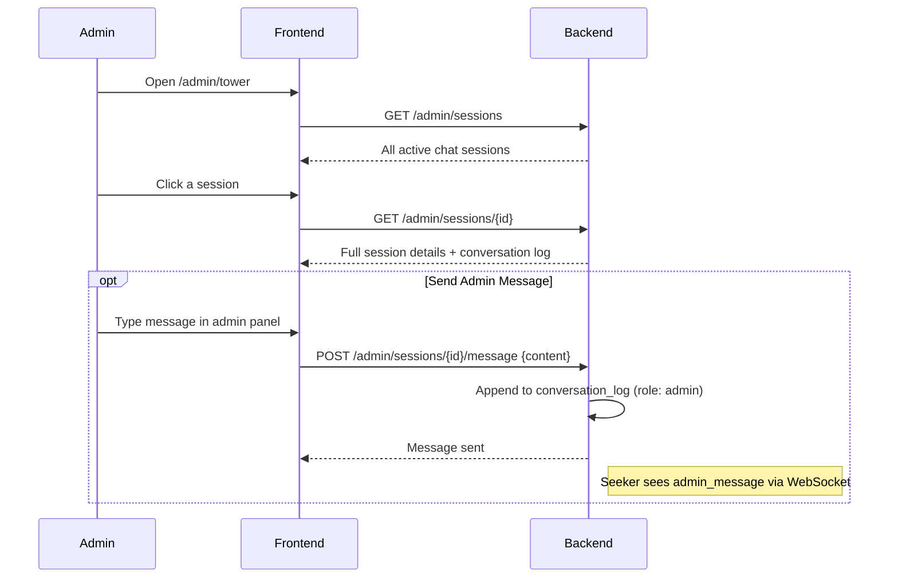

# User Flows — jobs.ottobon.cloud

## 1. Authentication Flow

## 2. Job Seeker — Full Journey

## 3. Job Provider — Posting Flow

## 4. Job Ingestion Pipeline (Automated)

## 5. Mock Interview Flow

## 6. Blog Generation Flow

## 7. Admin Control Tower

