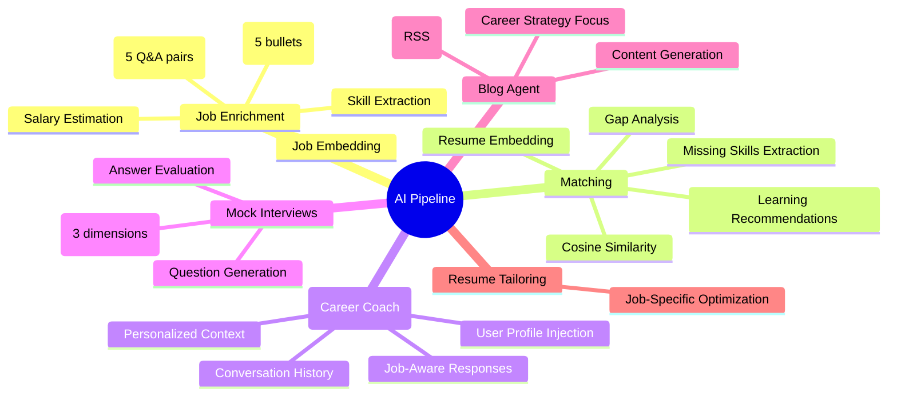

# AI Pipeline — jobs.ottobon.cloud

## Overview

AI is the core differentiator of the platform. Every major feature leverages OpenAI models for intelligent automation:



---

## 1. Job Enrichment Pipeline

**Trigger:** Job creation (manual by Provider) or ingestion (automated scraping)  
**Model:** GPT-4o via Instructor (structured output)

```
Input:
  - description_raw (full job description)
  - skills_required (if any)
  - title
  - company_name

Output (AIEnrichment schema):
  - resume_guide: list[str]  (exactly 5 actionable bullet points)
  - prep_questions: list[InterviewQuestion]  (exactly 5 Q&A pairs)
    - question: str
    - answer_strategy: str
  - extracted_skills: list[str]  (5-15 technical skills)
  - estimated_salary_range: str | None  (e.g. "$100k - $150k")
```

**Additionally:** A vector embedding is generated via `text-embedding-3-small` and stored in the `jobs.embedding` column (pgvector).

### Cost Optimization: SHA-256 Dedup
When a scraped job has an identical `description_raw` to an existing job:
1. Compute `SHA-256(description_raw)` → `description_hash`
2. Check if any existing job has the same hash with enrichment data
3. If found → **copy** `resume_guide_generated`, `prep_guide_generated`, `embedding` from the donor
4. Skip the OpenAI call entirely → **saves ~$0.02-0.05 per job**

---

## 2. Resume Processing & Embedding

**Trigger:** Seeker uploads a PDF resume  
**Pipeline:**

```
PDF File → PyPDF Text Extraction → Store resume_text
         → text-embedding-3-small → Store resume_embedding (pgvector)
         → Supabase Storage (original file for download)
```

The resume embedding enables semantic matching against job embeddings.

---

## 3. Matching Engine

**Trigger:** Seeker clicks "Match" on a job detail page  
**Algorithm:**

```
1. Retrieve user.resume_embedding (pgvector)
2. Retrieve job.embedding (pgvector)
3. Compute cosine_similarity(user_vec, job_vec)
4. If score ≥ 0.7 → Good match (no gaps)
5. If score < 0.7 → Gap detected:
   a. GPT-4o: analyze_gap(resume_text, job_description)
      → Narrative gap analysis paragraph
   b. GPT-4o: extract_missing_skills(resume_text, required_skills)
      → Structured list of missing skills
   c. Database: get_learning_resources(missing_skills)
      → Course recommendations from learning_resources table
   
   Steps (a) and (b) run in parallel via asyncio.gather()
```

**Gap Threshold:** `similarity_score < 0.7`

---

## 4. AI Career Coach (Chat)

**Trigger:** Seeker opens a chat session  
**Protocol:** WebSocket (`/ws/chat/{session_id}`)

### Context Injection Strategy

The AI receives a rich system prompt with personalized context:

```
System Context:
  - Candidate name (if set)
  - Resume text (truncated to 2000 chars to avoid token overflow)
  - Candidate skills list
  - Job context (if chat is linked to a specific job)
  - Full conversation history (excluding hidden system entries)
```

### Session Lifecycle

```
1. Client connects via WebSocket
2. Server sends history_replay (last 10 messages + session status)
3. If new session (no messages) → generate personalized greeting
4. User sends text → optimistic UI update → server processes:
   a. Append user message to conversation_log
   b. Build user context from profile + resume
   c. Call GPT-4o with history + context
   d. Append AI reply to conversation_log
   e. Send ai_reply via WebSocket
5. Heartbeat: Client sends __ping__ every 30s → Server replies __pong__
6. Auto-reconnect with exponential backoff (max 3 retries)
```

---

## 5. Mock Interview Engine

**Trigger:** Seeker starts a mock interview for a specific job

```
Phase 1 — Question Generation:
  Input: Job description + role
  Output: 5 role-specific technical interview questions
  Status: in_progress

Phase 2 — Answer Evaluation:
  Input: 5 user answers + original questions
  Output: MockScorecard
    - technical_accuracy: 1-10
    - clarity: 1-10
    - confidence: 1-10
    - summary_notes: detailed feedback
  Status: completed

Phase 3 (Optional) — Expert Review:
  Status: pending_review → reviewed
  Expert manually adds feedback
```

---

## 6. Blog Agent

**Trigger:** Admin calls `POST /blogs/generate`  
**Pipeline:**

```
1. MarketNewsService.fetch_big4_career_news(limit=5)
   → Fetches from Google News RSS for Deloitte, PwC, KPMG, EY
   → Returns: [{title, source, summary, link}]

2. BlogAgent constructs prompt:
   - Act as Career Strategist for university students
   - Translate each news item into a "Student Action"
   - Structure: Title → Executive Summary → News & Opportunity → Action Plan

3. GPT-4o generates JSON:
   { title, slug, summary, content (markdown) }

4. Store in blog_posts table with cover image
```

---

## OpenAI Model Usage Summary

| Feature | Model | Estimated Cost per Call |
|---------|-------|----------------------|
| Job Enrichment | `gpt-4o` (Instructor) | ~$0.02-0.05 |
| Job Embedding | `text-embedding-3-small` | ~$0.0001 |
| Resume Embedding | `text-embedding-3-small` | ~$0.0001 |
| Gap Analysis | `gpt-4o` | ~$0.01-0.03 |
| Missing Skills | `gpt-4o` (structured) | ~$0.01-0.02 |
| Chat Message | `gpt-4o` | ~$0.01-0.05 |
| Mock Interview | `gpt-4o` | ~$0.02-0.05 |
| Blog Generation | `gpt-4o` | ~$0.03-0.08 |
