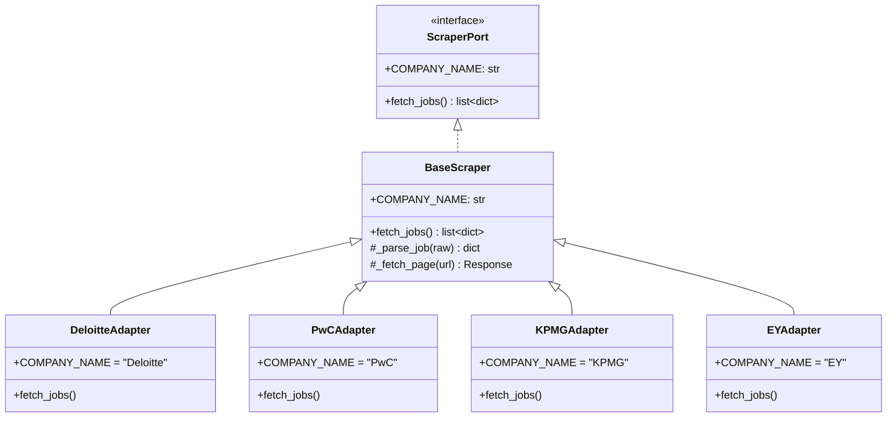

# Job Scraper & Ingestion — jobs.ottobon.cloud

## Overview

The platform automatically aggregates job listings from the Big 4 consulting firms via purpose-built web scrapers. This runs on a daily cron schedule and can also be triggered manually by admins.

## Supported Sources

| Source | Adapter | Target URL Pattern |
|--------|---------|-------------------|
| Deloitte | `deloitte_adapter.py` | Deloitte Careers API |
| PwC | `pwc_adapter.py` | PwC Careers API |
| KPMG | `kpmg_adapter.py` | KPMG Careers API |
| EY | `ey_adapter.py` | EY Careers API |

## Scraper Architecture



## Ingestion Pipeline

```
1. Scheduler fires at 10:00 PM IST daily (APScheduler CronTrigger)
2. Distributed lock acquired via cron_locks Supabase RPC
3. For each scraper:
   a. Create scraping_log entry (status: running)
   b. fetch_jobs() → array of raw job dicts
   c. For each job:
      - Dedup by (company_name, external_id)
      - If new: insert with status "processing"
      - SHA-256 hash check for AI cost dedup:
        - If hash match → copy enrichment from donor → status "active"
        - If no match → full AI enrichment → status "active"
   d. Finalize scraping_log:
      - success: all jobs processed
      - partial: some errors, some succeeded
      - failed: all failed or fetch error
4. Release distributed lock
```

## Experience Filter

The `experience_filter.py` module filters scraped jobs to target entry-level and early-career positions relevant to the student audience. This prevents senior executive roles from cluttering the feed.

## Scraped Job Data Schema

Each scraper produces jobs with this shape:
```json
{
  "title": "Analyst - Strategy & Operations",
  "description_raw": "Full HTML/text job description...",
  "skills_required": ["Excel", "PowerPoint", "Data Analysis"],
  "company_name": "Deloitte",
  "external_id": "JOB-12345",
  "external_apply_url": "https://careers.deloitte.com/..."
}
```

## Scheduling Details

| Parameter | Value |
|-----------|-------|
| Cron Trigger | `hour=22, minute=0` |
| Timezone | `Asia/Kolkata` (IST) |
| Lock TTL | 30 minutes |
| Lock Mechanism | PostgreSQL RPC (`acquire_cron_lock`) |

## Monitoring

Admin can view ingestion status via:
- `GET /admin/sessions` — active sessions
- `POST /admin/ingest/trigger?scraper_name=deloitte` — manual trigger for specific source
- `scraping_logs_jobs` table — historical run data with stats
