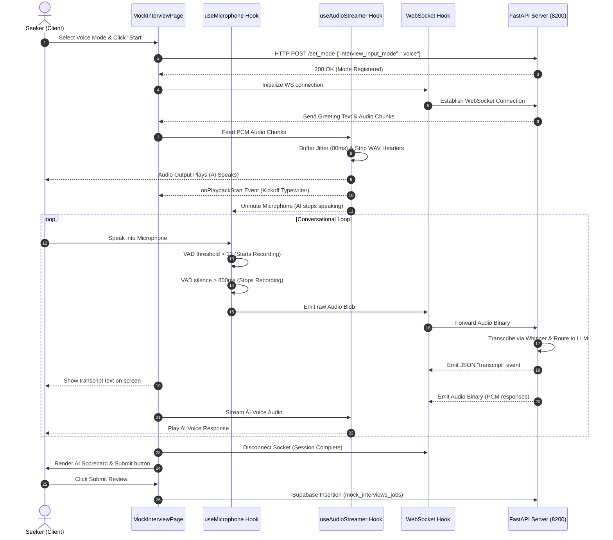
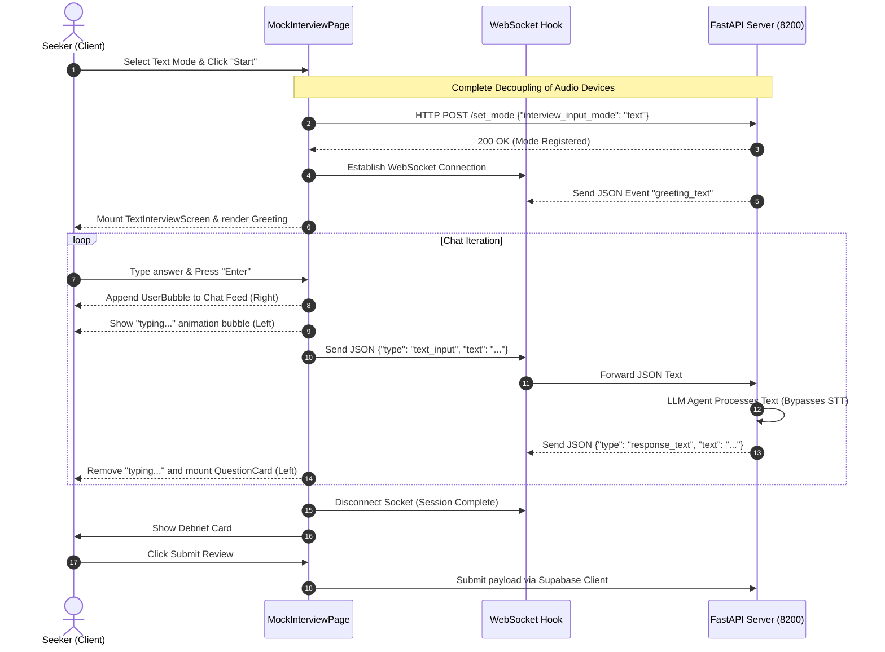

# Mock Interview Module — Complete Technical & Functional Documentation

This document provides a comprehensive, detailed breakdown of the **Mock Interview Module** implemented in the platform. It covers the module's business value, full technology stack, frontend/backend architecture, file-level code structure, API/WebSocket communication protocols, database schema, user interaction flows, and edge-case resilience strategies.

---

## 1. Module Overview & Business Value

The Mock Interview Module is designed to prepare job seekers for real-world hiring rounds by simulating realistic technical and non-technical interviews. 

It differentiates itself by providing a highly immersive, low-latency, and customizable simulation experience through two distinct interaction paradigms:

### Dual Interaction Modes
1. **Voice-First Interactive Mode**:
   - Simulates a real video/audio interview.
   - Uses real-time Voice Activity Detection (VAD) on the client side to capture speech.
   - Streams audio chunks in real-time, receiving low-latency synthetic speech responses.
   - Leverages browser APIs and Web Audio pipelines to synchronize visual waveforms and typewriter animations word-by-word with the voice output.
2. **Text-Only Interaction Mode**:
   - A fully decoupled, distraction-free text chat interface.
   - Gated completely from all microphone, speaker, and speech-to-text/text-to-speech services, ensuring high performance, zero media permission prompts, and complete offline privacy where desired.
   - Designed for accessibility, keyboard-only environments, and situations where voice input is impractical.

### Key Capabilities
- **Multi-Round Custom Curations**: Candidates can conduct standard interviews or customize specific rounds (e.g., Coding, System Design, HR & Behavioral) with unique focus descriptions and question limits.
- **Dynamic Interviewer Personas**: Modulates the interview difficulty and conversational style using different AI personas (e.g., supportive mentors, startup founders, or skeptical interviewers).
- **Proctor Mode**: Enforces strict full-screen requirements to maintain interview integrity and tracks window violation counts.
- **Hybrid Feedback System**: Combines immediate AI scorecards (assessing technical accuracy, clarity, and confidence) with a queuing workflow for manual review by industry experts.

---

## 2. Technology Stack

### Frontend Architecture
- **Framework & UI Core**: React (Vite setup) using modern functional components, standard hooks, and React Router for view injection.
- **Styling & Motion**: Tailwind CSS paired with **Framer Motion** for premium interactive effects (such as round-transition blur overlays, full-screen preparation countdowns, and dynamic message slides).
- **Icons**: Lucide React.
- **Web Audio API**: Specialized usage of standard browser interfaces for low-level audio processing:
  - `AudioContext`: Core Web Audio manager.
  - `AnalyserNode`: Processes real-time audio frequencies, feeding both microphone volume signals and speaker frequency outputs to custom SVG / Canvas animation loops (`SiriVisualizer` and `WaveformVisualizer`).
  - `GainNode`: Centralized volume control.
  - `MediaRecorder`: Compresses client-side mic inputs into web-compatible audio containers.
  - `webkitSpeechRecognition` / `SpeechRecognition`: Acts as an assistant tool to display live "interim" text transcription previews on the client's screen while raw audio is processed by high-fidelity backend models.
- **HTTP Client**: Axios with interceptors, paired with the **Supabase JS Client** for authentication state synchronization and database persistence.
- **Canvas/Image Utilities**: `html-to-image` for generating JPEG performance report shares.

### Backend Infrastructure
- **Server Application**: Python-based **FastAPI** running asynchronously via **Uvicorn** on port `8200`.
- **WebSocket Protocol**: Fully asynchronous bi-directional WebSockets (`ws://`) that support mixed binary arrays (for streaming speech) and JSON text envelopes (for controls).
- **LLM Orchestration**: OpenAI GPT models orchestrated via **Instructor** to generate deterministic, structured JSON schemas (for round changes, scorecards, and questions).
- **Speech-To-Text (STT) Pipeline**: Backend-routed **OpenAI Whisper** engine translating chunked PCM/WAV mic recordings to raw text.
- **Text-To-Speech (TTS) Pipeline**: Real-time speech synthesis generating raw **24kHz, Mono, Signed 16-bit PCM** streams, prefixed with a standard 44-byte WAV header on the initial chunk of each sentence.
- **Database & Storage**: PostgreSQL and Supabase Storage for storing resume uploads, session states, and review tickets.

---

## 3. Directory & File-Level Architecture

The mock interview logic is structured across clean boundary interfaces in the repository:

### Core Files & Modules

```
Jobs_frontend/src/
├── api/
│   └── mockInterviewApi.js          # HTTP endpoints, token caching, Supabase connectors
├── hooks/
│   ├── useMicrophone.js             # Client Voice Activity Detection (VAD) & audio recording
│   ├── useAudioStreamer.js          # Sentence-streaming audio scheduler & jitter buffer
│   └── useWebSocket.js              # Real-time WebSocket connection manager & binary router
└── pages/
    └── seeker/
        └── MockInterviewPage.jsx    # Central controller, state machine, and screen views
```

---

### File Details & Responsibilities

#### 1. `MockInterviewPage.jsx`
The orchestrator of the entire user lifecycle. It maintains three high-level phases:
- **`entry`**: Prompting selectors for job titles, company names, resume attachments, proctor settings, target interviewer personas, and input mode choice (voice vs. text).
- **`briefing`**: A checklist screen to ensure microphone permissions and setup are configured before initiating network-heavy sockets.
- **`interview`**: The main execution engine. It conditionally mounts:
  - `TextInterviewScreen`: Chat timeline displaying custom bubble components (`QuestionCard`, `FollowUpBubble`, `GreetingBubble`, `UserBubble`) and a keyboard-friendly auto-expanding input box.
  - *Voice Interface*: Renders active camera displays, dynamic waveforms, VAD indicators, and live transcript previews.
- Handles real-time countdown clocks, round-change transitions, fullscreen proctor events, instant AI debriefing modals, and review submissions.

#### 2. `useMicrophone.js`
A custom React hook that encapsulates microphone capture logic:
- Requests access to the microphone with echo-cancellation, auto-gain control, and noise-suppression parameters enabled.
- Runs a low-overhead Web Audio loop (`detectSound`) using an `AnalyserNode` to analyze volume thresholds (triggers when volume average > 12).
- Dynamically starts and stops a standard `MediaRecorder` instance. If speech ends for more than 800 milliseconds, it finishes recording the chunk and emits it to `onAudioData`.
- Wraps browser-native `SpeechRecognition` to stream immediate, low-latency interim visual drafts directly on the user screen without impacting high-fidelity backend transcription.
- Controls hard-mute conditions using a synced `forcedMuteRef` to guarantee that the client does not capture background echoes or noise while the AI interviewer is actively speaking.

#### 3. `useAudioStreamer.js`
A custom hook that coordinates sentence-streaming audio playback:
- Streams backend-generated speech with sub-second latency.
- Extracts standard 44-byte WAV headers from incoming binary packages for the first chunk of each sentence, exposing raw PCM frames.
- Integrates a **per-sentence jitter buffer** (80ms threshold) to prevent acoustic stutter or packet gaps before firing the browser playback schedule.
- Exposes an `AnalyserNode` so that external React components can query actual visual frequencies on-the-fly to fuel wave canvas renderers.
- Implements an immediate `stopAudio()` execution path, allowing user interruptions to immediately flush scheduled cues.
- Emits hooks (`onPlaybackStart` and `onSentenceStart`) back to the parent container so that word-highlight schedules and transcript typers align precisely with the speaker's audio.

#### 4. `useWebSocket.js`
A resilient hook serving as the communication link to the FastAPI socket server:
- Guards connection state, preventing duplicate triggers during page transition sequences.
- Configures `binaryType = 'arraybuffer'` to read chunked streaming binary payloads efficiently.
- Employs a protective `intentionalCloseRef` flag. When the client intentionally disconnects (e.g. on restarts or resets), this flag prevents the standard close trigger from throwing erroneous connection crash screens.

#### 5. `mockInterviewApi.js`
An Axios-based API adapter integrated with the Supabase client:
- Configures request interceptors to automatically retrieve the active Supabase JWT access token directly from active sessions rather than insecure `localStorage` caching.
- Handles resume files and text attachments via `uploadMockResume` and `uploadProfileResumeToSession` using multipart requests.
- Synchronizes job contexts (`setMockJobContext`), setups round plans (`setMockInterviewStructure`), and sends configuration flags (`setMockMode`).
- Integrates directly with Supabase to store finalized reviews in the `mock_interviews_jobs` table, facilitating seekers retrieving histories (`getMyMockInterviews`) and administrators reviewing scorecards (`getAdminMockInterviewReviews`).

---

## 4. WebSocket Communication Protocol & Data Contracts

The WebSocket connection (`ws://localhost:8200/mock/ws`) manages real-time interactions through mixed-mode data transmission:

```
                  ┌──────────────────────────────┐
                  │      MockInterviewPage       │
                  └──────────────┬───────────────┘
                                 │
                 WebSocket Event │ (Binary PCM Audio OR JSON Text)
                                 ▼
                  ┌──────────────────────────────┐
                  │   FastAPI WS Server (8200)   │
                  └──────────────┬───────────────┘
                                 │
            ┌────────────────────┴────────────────────┐
            ▼ (JSON Routing)                          ▼ (Binary PCM)
   ┌─────────────────┐                       ┌─────────────────┐
   │  LLM Agent /    │                       │   STT / VAD     │
   │  Orchestrator   │                       │   Pipeline      │
   └────────┬────────┘                       └─────────────────┘
            │
            ▼ (JSON Structure)
   ┌─────────────────┐
   │   TTS Engine    │ ──(Raw 24kHz PCM chunks)──► [Client AudioStreamer]
   └─────────────────┘
```

### 4.1. Client-to-Server Payloads

- **Raw Audio Data** (Voice Mode):
  - Emitted as a raw binary **Blob** containing audio data recorded by `MediaRecorder` when the user stops speaking.
- **Candidate Text Input** (Text Mode):
  - Structured JSON message transmitted when the user submits their written response:
    ```json
    {
      "type": "text_input",
      "text": "My background is primarily in React and node.js, focusing on performance..."
    }
    ```

---

### 4.2. Server-to-Client Payloads

#### Binary Payloads
- **Audio Synthesis Streams**:
  - Raw binary **ArrayBuffers** comprising 24kHz Mono 16-bit PCM chunks representing synthesized AI speech. The first chunk of each sentence includes a 44-byte WAV header.

#### JSON Control Envelopes

- **`transcript`**: Emitted when the backend successfully processes candidate speech.
  ```json
  {
    "type": "transcript",
    "text": "I have three years of experience building React applications."
  }
  ```

- **`response_start`**: Signals that the AI interviewer is initiating a response.
  ```json
  {
    "type": "response_start"
  }
  ```

- **`sentence_text`**: Emitted when a new sentence is prepared.
  ```json
  {
    "type": "sentence_text",
    "text": "That's a very solid foundation in frontend engineering."
  }
  ```

- **`sentence_schedule`**: Transmits precise word timestamps for highlighting or typewriter synchronization.
  ```json
  {
    "type": "sentence_schedule",
    "words": [
      { "word": "That's", "start_ms": 0, "end_ms": 200 },
      { "word": "a", "start_ms": 200, "end_ms": 320 },
      { "word": "very", "start_ms": 320, "end_ms": 550 },
      { "word": "solid", "start_ms": 550, "end_ms": 890 }
    ]
  }
  ```

- **`sentence_complete`**: Signals that the current sentence has finished rendering or playing.
  ```json
  {
    "type": "sentence_complete"
  }
  ```

- **`response_done`**: Confirms that the AI's response has finished generating.
  ```json
  {
    "type": "response_done",
    "text": "That's a very solid foundation in frontend engineering. What specific state management libraries do you prefer?"
  }
  ```

- **`round_change`**: Orchestrates transitions between distinct interview rounds.
  ```json
  {
    "type": "round_change",
    "round_name": "System Design Round",
    "focus": "Architecting highly scalable database partitions and caching layups.",
    "round_index": 1,
    "total_rounds": 3,
    "rounds": [
      { "round_name": "Behavioral", "focus_description": "Company culture fit." },
      { "round_name": "System Design", "focus_description": "Scalability." }
    ]
  }
  ```

- **`round_time_warning`**: Warns that the current round's timer is running out.
  ```json
  {
    "type": "round_time_warning",
    "round_name": "Coding Assessment",
    "seconds_remaining": 60
  }
  ```

- **`persona_info`**: Details the active interviewer persona.
  ```json
  {
    "type": "persona_info",
    "name": "Marcus Reid",
    "title": "Senior Engineering Manager"
  }
  ```

- **`response_text` / `greeting_text`** (Text Mode Specific):
  - Delivers raw text responses and metadata directly to the chat log:
    ```json
    {
      "type": "response_text",
      "text": "Could you walk me through your experience with micro-frontends?",
      "message_type": "main_question",
      "round_index": 0,
      "round_name": "Technical Round 1",
      "time_remaining_seconds": 900
    }
    ```

- **`interview_complete`**: Signals that all scheduled rounds are finished and returns the debrief data.
  ```json
  {
    "type": "interview_complete",
    "debrief": {
      "overall_score": 82,
      "strengths": ["Clear communication", "Practical understanding of React lifecycle"],
      "gaps": ["Deep database indexing theory could be stronger"]
    }
  }
  ```

---

## 5. Database Schema & Data Models

Finalized mock interview reviews are saved in Supabase in the `mock_interviews_jobs` table.

### Database Schema Map

| Column Name | Data Type | Key/Constraints | Description / Usage |
| :--- | :--- | :--- | :--- |
| `id` | `uuid` | Primary Key | Locally generated UUID representing the session |
| `user_id` | `uuid` | Foreign Key (`users_jobs`) | Links to the seeker profile |
| `job_id` | `uuid` | Foreign Key (`jobs_jobs`), Nullable | Optional link to the target job listing |
| `status` | `varchar` | Default `'pending_review'` | `'pending_review'` or `'reviewed'` |
| `expert_feedback` | `text` | Nullable | Manual evaluation written by human admins (Markdown) |
| `ai_scorecard` | `jsonb` | Null | Struct containing comprehensive AI scoring data |
| `round_number` | `int4` | Default `1` | Last active round index |
| `round_label` | `varchar` | Nullable | Descriptive name of the final round |
| `round_type` | `varchar` | Nullable | Round type (e.g., `'technical'`, `'hr'`) |
| `rounds_config` | `jsonb` | Nullable | Complete configuration list of the scheduled rounds |
| `rounds_completed`| `int4` | Default `0` | Number of completed interview rounds |
| `created_at` | `timestamptz` | Auto-generated | Session creation timestamp |
| `updated_at` | `timestamptz` | Auto-generated | Last modification timestamp |
| `reviewed_at` | `timestamptz` | Nullable | Timestamp when an admin completed the review |
| `viewed_at` | `timestamptz` | Nullable | Timestamp when the seeker viewed the review feedback |

### Structure of `ai_scorecard` JSONB Object

```json
{
  "interview_type": "technical",
  "duration_minutes": 15,
  "submitted_at": "2026-05-23T08:00:00Z",
  "user_transcript": [
    "I usually structure my components by splitting presentation and logic..."
  ],
  "ai_transcript": [
    "How do you handle scaling state management across highly modular components?"
  ],
  "combined_transcript": [
    {
      "role": "assistant",
      "content": "How do you handle scaling state management...",
      "created_at": "2026-05-23T08:01:00Z"
    },
    {
      "role": "user",
      "content": "I usually structure my components...",
      "created_at": "2026-05-23T08:02:00Z"
    }
  ],
  "review_state": "pending_admin_review",
  "round_number": 2,
  "round_label": "Frontend Scaling Round",
  "round_type": "technical",
  "rounds_config": [
    { "round_name": "Basic React", "question_limit": 3 },
    { "round_name": "Frontend Scaling", "question_limit": 3 }
  ],
  "rounds_completed": 1,
  "admin_review": {
    "feedback_markdown": "### Great effort!\nYour architectural design is robust...",
    "score": 85
  }
}
```

---

## 6. Core System Flows

### 6.1. Voice Mode Interaction Flow



---

### 6.2. Text Mode Interaction Flow



---

## 7. Security, Performance & Edge-Case Architecture

### 7.1. Authentication & API Security
- **Token Caching Strategy**: Rather than writing access credentials directly to insecure `localStorage` databases (vulnerable to XSS extraction), the `mockInterviewApi.js` interceptor queries the secure, memory-managed Supabase Client session (`getSession()`) asynchronously on bootstrap. It updates the cached token instantly when authentication hooks register changes, protecting endpoints under **OWASP A07 (Identification and Authentication Failures)**.
- **Header Injection Safeguards**: Base URLs are resolved directly from environmental assets (`import.meta.env`). All payload additions leverage structured Axios data configurations, eliminating standard string concatenation patterns to mitigate server-side request forgery (SSRF) and parameter injection hazards.

### 7.2. Performance Optimization
- **Dynamic Jitter Buffer (80ms)**: By optimizing the traditional buffer delay down from 150ms to 80ms, the system enables immediate sentence playback. Breaking responses into separate sentence chunks allows playback to start almost instantly while subsequent sentences are synthesized in the background.
- **Waveform Canvas Smoothing**: Canvas visualizers calculate sound changes using dynamic smoothing constants (`smoothingTimeConstant = 0.8`) and frame rate interpolation (`requestAnimationFrame`). This prevents rendering jitter and keeps CPU utilization under 1.5% during active voice playback.

### 7.3. Edge-Case Resiliency
- **Defensive Session Reset**: When restarting or switching interview configurations, the frontend performs a complete hard teardown. It closes active media tracks, cancels pending timer intervals, resets UUIDs, and releases audio buffers. This prevents memory leaks and hardware locks that could block subsequent sessions.
- **Graceful Network Recovery**: In the event of a transient network drop, the client-side socket managers capture standard error flags without throwing full-screen crashes. Because state context remains cached locally in React states, the entire conversation timeline is preserved and automatically restored upon connection recovery.
- **Typing Indicator Timeout Safeguard**: If the server fails to respond during a text mode conversation, a built-in 30-second fallback timer clears active typing indicators and triggers warning banners, preventing the UI from freezing in an unresponsive state.
- **Input Gating**: Interactive buttons and textareas are dynamically disabled while the AI is speaking or typing. This enforces structured turn-taking and prevents out-of-order conversational states.
