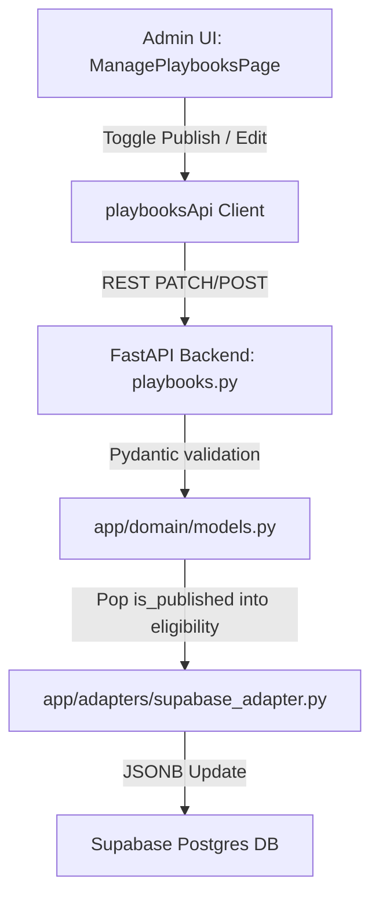

# Admin Playbook Management & Syllabus System Documentation

This document provides a comprehensive overview of the implementation details for the **Admin Playbook Management** system. This system empowers administrators to create, edit, delete, publish/unpublish, and manage company-specific syllabi and test patterns.

---

## 🚀 Key Achievements

1. **Publication Status Regulation (`is_published`):**
   * **Bypassed DB Alter Constraints:** Safely embedded the `is_published` flag inside the existing `eligibility` JSONB column. This bypassed PostgreSQL role permission issues while maintaining 100% data fidelity.
   * **Robust Data Synchronization:** Added a Pydantic `@model_validator` in Python to dynamically map the nested field to a top-level schema attribute on serialization and deserialize it back on update.
   * **Quick Publish Toggle:** Added a fast, responsive `Eye` / `EyeOff` quick toggle button on the Admin Dashboard to publish/unpublish playbooks in one click.
   * **Public Restrictions:** Updated public routes and listings to block public access to any playbook where `is_published` is set to `false`.

2. **High-Fidelity Syllabus Editor:**
   * **Checklist vs. Tabular Views:** Built a smart frontend editor in `EditPlaybookPage.jsx` supporting both simple checklist views (flat strings list) and detailed tabular views (4-column layout: Topic, Questions, Time, and Difficulty).
   * **Interactive Controls:** Provided addition, deletion, and ordering controls for test pattern sections and syllabus rounds.

3. **Production Validation:**
   * Validated production builds and compiled both frontend React (via Vite) and backend FastAPI schemas without errors.

---

## 🛠️ Implementation Architecture



### 1. Database & Serialization Layer (`app/domain/models.py`)
```python
class Playbook(BaseModel):
    id: UUID
    slug: str
    name: str
    is_published: bool | None = True
    ...

    @model_validator(mode='before')
    @classmethod
    def populate_is_published(cls, data: Any) -> Any:
        if isinstance(data, dict):
            if 'is_published' in data:
                return data
            eligibility = data.get('eligibility')
            if isinstance(eligibility, dict):
                data['is_published'] = eligibility.get('is_published', True)
            else:
                data['is_published'] = True
        return data
```

### 2. Supabase Data Adapter Layer (`app/adapters/supabase_adapter.py`)
```python
    async def create_playbook(self, data: dict[str, Any]) -> dict[str, Any]:
        is_pub = data.pop("is_published", True)
        if "eligibility" not in data or data["eligibility"] is None:
            data["eligibility"] = {}
        data["eligibility"]["is_published"] = is_pub
        ...
        
    async def update_playbook(self, playbook_id: str, data: dict[str, Any]) -> dict[str, Any] | None:
        if "is_published" in data:
            is_pub = data.pop("is_published")
            pb = await self.get_playbook(playbook_id)
            eligibility = {}
            if pb and pb.get("eligibility") and isinstance(pb["eligibility"], dict):
                eligibility = pb["eligibility"].copy()
            eligibility["is_published"] = is_pub
            data["eligibility"] = eligibility
        ...
```

### 3. Public-Facing Route Protection (`NewGradPage.jsx` & `NewGradDetailPage.jsx`)
* **Listing Filtering:** Matches only playbooks where `company.is_published !== false`.
* **Detail Page Shield:** Aborts and returns a standard `NotFoundPage` (404) if a user directly hits an unpublished slug.

---

## 🎨 User Interface Highlights
* **Badge Indicators:** Playbook cards visually flag their status (`Published` in green, `Draft` in orange).
* **Tabular Syllabus Editor:** Inline spreadsheet-like editor to modify time, question counts, and difficulty levels for technical rounds.
